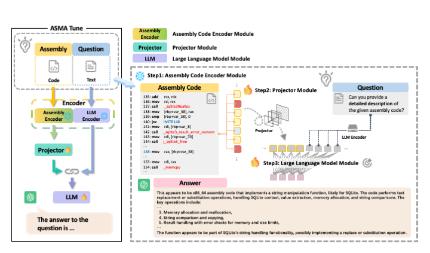

# ASMA-Tune: Unlocking LLMs' Assembly Code Comprehension via Structural-Semantic Instruction Tuning

## Overview

Analysis and comprehension of assembly code are crucial in various applications, such as reverse engineering. However, the low information density and lack of explicit syntactic structures in assembly code pose significant challenges. Pioneering approaches with masked language modeling (MLM)-based methods have been limited by facilitating natural language interaction. While recent methods based on decoder-focused large language models (LLMs) have significantly enhanced semantic representation, they still struggle to capture the nuanced and sparse semantic patterns in assembly code. In this paper, we propose Assembly Augmented Tuning (\toolname), an end-to-end structural-semantic instruction-tuning framework. Our approach synergizes encoder architectures with decoder-based LLMs to enable comprehensive code understanding. Experiments show that \toolname outperforms existing benchmarks, significantly enhancing assembly code comprehension and instruction-following abilities. The code will be released.
